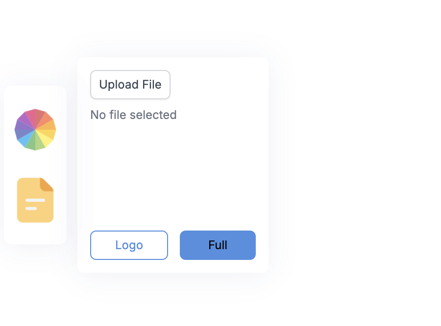

# Product Visualizer

Here we have created a product visualizer for T-Shirt where you can visualize the how T-Shirt will look like with custom logos and colours

### Home Screen

### Editor Screen

### Editor Options

- Using colour picker you can select any colour
- Using file picker you can use your custom logo

### Final Product View

> Here you got two options for the visualizing the T-Shirt with and without logo and full size logo

## Credits

This product is for learning purposes only and all credits are goes to [Adrian Hajdin](https://github.com/adrianhajdin)

You can find out tutorial [here](https://youtu.be/ZqEa8fTxypQ?si=9CKoUDsMMmKUncH8)